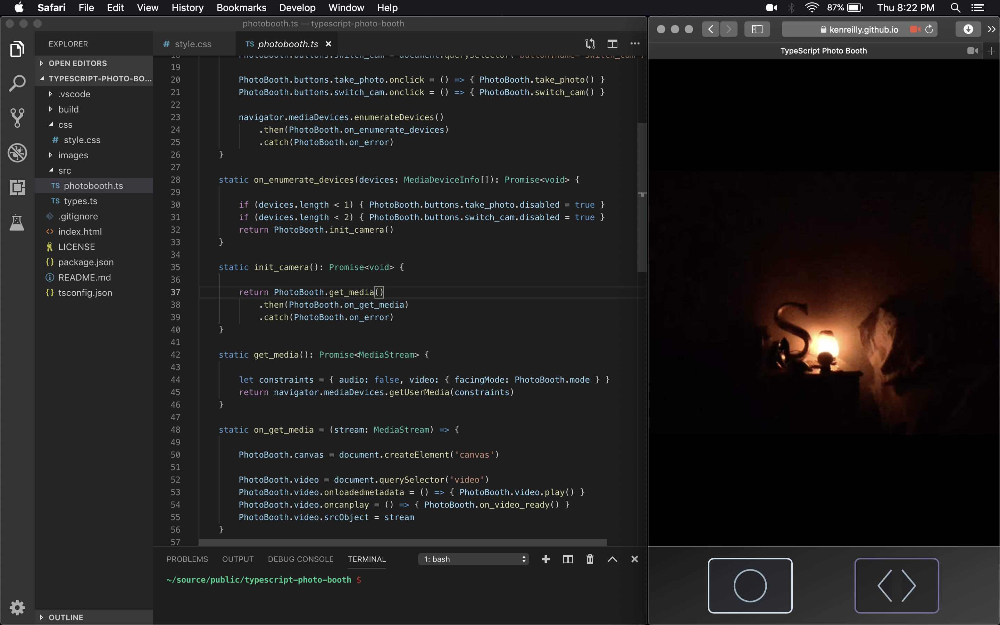

# typescript-photo-booth
Simple photo booth application built with HTML, CSS, and TypeScript

### Introduction
This project is the companion source for the corresponding article:

[📷 Building a Camera App in TypeScript](https://itnext.io/building-a-camera-app-in-typescript-f1981f5ce960).

### Live Demo
Check out the GH Pages live demo [here](https://kenreilly.github.io/typescript-photo-booth).

### Getting Started
To get started, clone the project and make sure you have a working Node and TypeScript environment set up. Next, simply run `tsc` in the project folder and then serve the app using a local server such as `serve`.
